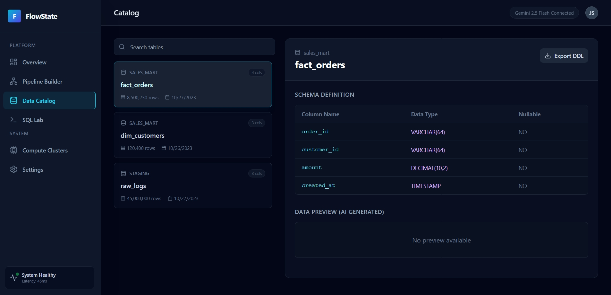
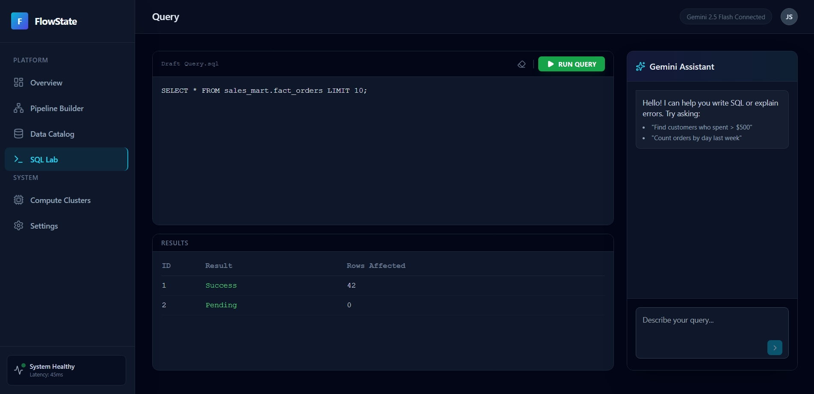
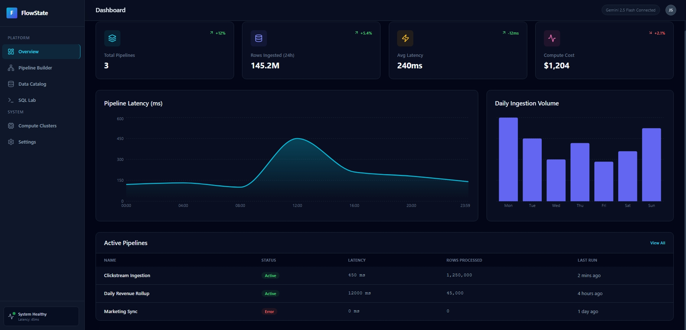

## Overview
**Data Pipeline**

**Data Catalog**

**Query Engine Lab**

**Dashboard**

## Run Locally

**Prerequisites:**  Node.js

1. Install dependencies:
   `npm install`
2. Set the `GEMINI_API_KEY` in [.env](.env.local) to your Gemini API key
3. Run the app:
   `npm run dev`
